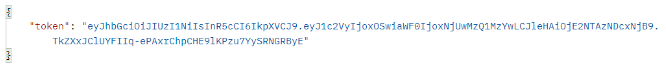

# e-money-kelompok-6

## Kelompok 6:  
Rachmita Annisa Aulia - 5027201032  
Afrida Rohmatin Nuriyah - 5027201037  
Shafira Khaerunnisa Latif - 5027201072  

## Nama e-money: MoneyZ  

## Dokumentasi API:  
Dokumentasi API dari MoneyZ dapat diakses [di sini](https://docs.google.com/document/d/1dvpENrrnmunwrTRknEkh9BjOmM7EPYgswFIaWEOweuI/edit?usp=sharing)

### register
  * Method : `POST`
  * Alamat URL : https://moneyz-kelompok6.herokuapp.com/api/register
  * Parameter :

| Parameter | Description | Optional | Default | 
| ----------- | ----------- | ----------- | ----------- |
| username | Berupa string dengan panjang min. 3 char dan tidak boleh sama dengan user lain |  |  |
| email | Berupa string dan angka dengan panjang min. 8 char |  |  |
| password | Berupa email user dengan format menggunakan @ dan belum pernah digunakan untuk register sebelumnya |  |  |
| phone | Berupa nomor hp user dengan panjang max. 15 char dan belum pernah digunakan untuk register sebelumnnya |  |  |
  
 * Contoh 1

`POST`  https://moneyz-kelompok6.herokuapp.com/api/register

Parameter
```
{
    "username": "tesdokumentasi",
    "password": "tesdokumentasi123",
    "email": "tesdokumentasi@gmail.com",
    "phone": "08934238940"
}
```
Respon




 * Contoh 2
 
 `POST`	https://moneyz-kelompok6.herokuapp.com/api/register

Parameter
```
{
    "username": "tesdokumentasi",
    "password": "tesdokumentasi123",
    "email": "tesdokumentasi@gmail.com",
    "phone": "08934238940"
}
```
Respon

### login

* Method : `POST`
* Alamat URL : https://moneyz-kelompok6.herokuapp.com/api/login
* Parameter

| Parameter | Description | Optional | Default | 
| ----------- | ----------- | ----------- | ----------- |  
| username | Brupa string yang sudah terdaftar saat register |  |  |
| password | Berupa string yang sudah terdaftar saat register |  |  |

* Contoh 1

Contoh 1
`POST`		https://moneyz-kelompok6.herokuapp.com/api/login

Parameter
```
{
    "username": "tesdokumentasi",
    "password": "tesdokumentasi123"
}
```
Respon

* Contoh 2

`POST` 	https://moneyz-kelompok6.herokuapp.com/api/login

Parameter
```
{
    "username": "tesdokumentasi",
    "password": "tesdokumentasi1234"
}
```

Respon

### getalluser

* Method : `GET`
* Alamat URL : https://moneyz-kelompok6.herokuapp.com/api/admin
* Parameter : -

* Contoh 1

`GET`		https://moneyz-kelompok6.herokuapp.com/api/admin

Respon

* Contoh 2

`GET`		https://moneyz-kelompok6.herokuapp.com/api/admin

Respon

### topup

* Method : `POST`
* Alamat URL : https://moneyz-kelompok6.herokuapp.com/api/admin/topup/:id
* Parameter

| Parameter | Description | Optional | Default | 
| ----------- | ----------- | ----------- | ----------- |
| id | Berupa nomor id internal yang menjadi identitas dari data terkait|  |  |
| nominal | Berupa jumlah uang yang akan ditambahkan ke akun MoneyZ user|  |  |

* Contoh 1

`POST`		https://moneyz-kelompok6.herokuapp.com/api/admin/topup/12

Parameter
```
{
    "nominal": "10000"
}
```

Respon

* Contoh 2

`POST`		https://moneyz-kelompok6.herokuapp.com/api/admin/topup/12

Parameter
```
{
    "nominal": "10000"
}
```

Respon

### transfer

* Method : `POST`
* Alamat URL : https://moneyz-kelompok6.herokuapp.com/api/user/transfer/:id
* Parameter

| Parameter | Description | Optional | Default | 
| ----------- | ----------- | ----------- | ----------- |
| id | Berupa nomor id internal yang menjadi identitas dari data terkait | Tidak | |
| idtujuan | Berupa nomor id tujuan yang menjadi identitas dari data terkait. perlu diisi apabila ingin melakukan pengiriman uang | Tidak | |
| nominal | Berupa jumlah uang yang akan ditransfer ke akun MoneyZ user | Tidak | 0 |

* Contoh 1

`POST`		https://moneyz-kelompok6.herokuapp.com/api/user/transfer/12

Parameter
```
{
     "idtujuan": "13",
     "nominal": "5000"
}
```
Respon

* Contoh 2

`POST` 	https://moneyz-kelompok6.herokuapp.com/api/user/transfer/12

Parameter
```
{
    "idtujuan": "13",
    "nominal": "5000"
}
```

Respon

### balance

* Method : `GET`
* Alamat URL : https://moneyz-kelompok6.herokuapp.com/api/user/balance/:id
* Parameter

| Parameter | Description | Optional | Default | 
| ----------- | ----------- | ----------- | ----------- |
| id | Berupa nomor id internal yang menjadi identitas dari data terkait. perlu diisi apabila ingin melakukan perubahan atau penghapusan data terkait | Tidak | |

* Contoh 1

`GET`		https://moneyz-kelompok6.herokuapp.com/api/user/balance/:id

Respon

* Contoh 2

`GET`	https://moneyz-kelompok6.herokuapp.com/api/user/transfer/12

Respon

### history

* Method : `GET`
* Alamat URL : https://moneyz-kelompok6.herokuapp.com/api/user/history/:id
* Parameter

| Parameter | Description | Optional | Default | 
| ----------- | ----------- | ----------- | ----------- |
| id | Berupa nomor id internal yang menjadi identitas dari data terkait | Tidak | |

* Contoh 1

`GET`		https://moneyz-kelompok6.herokuapp.com/api/user/history/12

Respon

* Contoh 2

`GET`		https://moneyz-kelompok6.herokuapp.com/api/user/history/12

Respon


e-money-kelompok-6 created by GitHub Classroom
